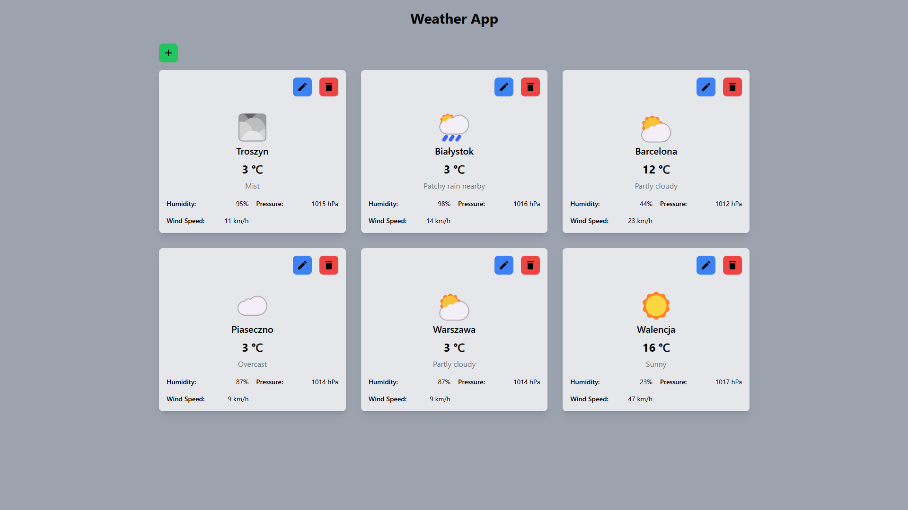

# Weather

Simple CRUD app using .NET and Angular

## Table of contents

* [Launch](#launch)
* [Presentation](#presentation)
* [Technologies](#technologies)
* [Architecture](#architecture)
* [Project types and references](#project-types-and-references)
* [Features](#features)

## Launch

Run application with two commands (setup all docker containers, create database, apply migrations):

```
cd C:\Users\bartl\source\repos\Weather\src\Weather.Api
docker compose up --build -d

cd C:\Users\bartl\source\repos\Weather\src\weather
ng serve
```

Created containers:

- C# Web API backend:

```
http://localhost:5000
```

- MSSQL database:

```
Host: localhost 
Port: 1433 
Database/Schema: Weather
Username: sa
Password: Password1!
Server: weather.database
```

- Seq Api logs:

```
http://localhost:8081
```

- Angular frontend:

```
http://localhost:4200
```

## Presentation

Weather view:


## Technologies

- C# 13
- .NET 9.0
- Angular 19

## Architecture

Angular frontend with .NET Minimal API backend connecting to the MSSQL database. Monolithic architecture with
Vertical Slices. Code separated by feature.

## Project types and references

- Weather.Api - ASP .NET Core Web API (Backend)
- weather - Angular Project (Frontend)

## Features

- Cities
    - Create city
    - Delete city
    - Update city
    - Get all cities (load cities weather)
    - Get city (load city weather)

